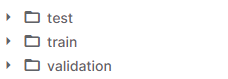
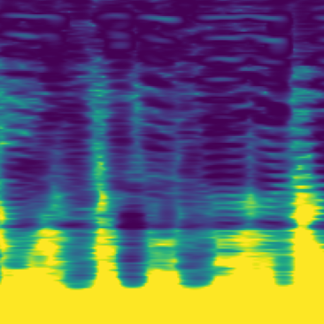
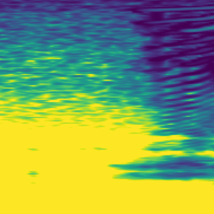

# Surgical Mask Detection
This project started as a kaggle competition for a university task that I was given.   
     
The task I had was to come up with a software solution that is able to discriminate between utterances with and without surgical masks.   

The system could be useful in the context of the COVID-19 pandemic, by allowing the automatic verification of surgical mask wearing from speech.

## Tools used
In this project I made use of the [Keras](https://keras.io) framework and [TensorFlow](tensorflow.org/) for the deep learning
and the [librosa](https://librosa.org/doc/latest/index.html) python package.

## Project Structure
The initial dataset was made up of 12.000 sounds split into 3 sets as you can see below:   

   
* The `test` directory contained 3.000 sounds that were going to be used for the final evaluation of the trained model.    
* The `train` directory contained 8.000 sounds that were going to be used in training our model.
* The `validation` directory contained 1.000 sounds that were going to be used for the validation of our model.   

The files in the initial dataset were in the `*.wav` files and the model I was intending to use required images as input.   
For this reason I used the `librosa` to generate the spectrogram of each sound in the dataset and save them in `.png` format to later use them
in training the network.

Below you can see 2 examples of spectrograms from the `with_mask` category:

## Approach
I came up with this idea by seeing a similar project. The said [project](https://www.pyimagesearch.com/2018/12/03/deep-learning-and-medical-image-analysis-with-keras/)
used a similar approach to identify cells infected with malaria.   

The malaria project was, like my project, a binary classification problem.
So I built a residual neural network model that I trained on the spectrograms dataset.    

The architecture of the model is defined in the `resnet.py` script that can be found in the `pyimagesearch` directory.

## Romanian Documentation
You can find a complete documentation written in Romanian inside the `doc` directory of this project.
